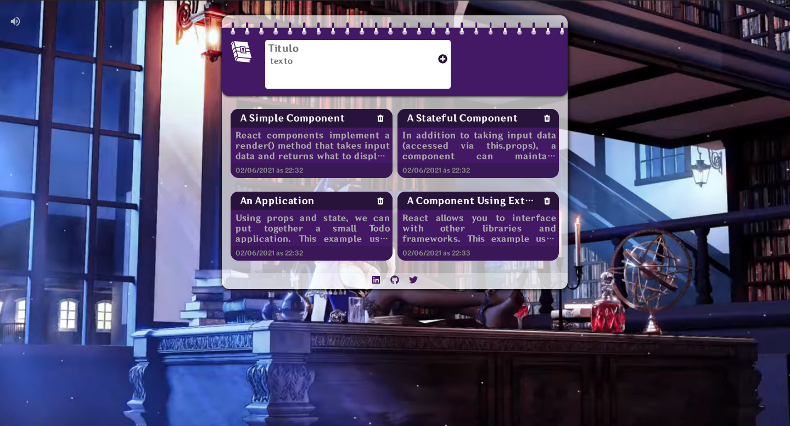

<div align="center">

</div>
<br>

<h1 align="center">Lisa`s Notes</h1>


---

<p align="center">
  <a href="#-About">Sobre</a>&nbsp;✦&nbsp;
  <a href="#-Layout">Layout</a>&nbsp;✦&nbsp;
  <a href="#-Tecnologias">Tecnologias</a>&nbsp;✦&nbsp;
  <a href="#-Teste-o-Projeto">Teste a Aplicação</a>&nbsp;✦&nbsp;
  <a href="#-License">License</a>
</p>

## 📃 **About**

 notepad - Baseado no jogo Genshin Impact mas especificamente na bibliotecária dos Cavaleiros de Favonius, além de sua elegância e charme, Lisa também é altamente educada. baseado nisso criei um bloco de notas que armazena as suas anotações no localStorage, podendo edita-las e salvar a qualquer momento.

---

## 🧩 **Layout**



---

## ⚙ **Tecnologias**

- [**javaScript**](https://www.w3schools.com/js/)
    - [**date-fns v2.22.1**](https://date-fns.org/)
    - [**Reactjs v17.0.2**](https://reactjs.org/)
    - [**React-icons v1.33.0**](https://react-icons.github.io/react-icons)
- [**CSS**](https://www.w3schools.com/css/)
    - [**Sass v1.33.0**](https://sass-lang.com/)

---

## 📔 **Teste o Projeto**
- clone o repositorio obs: para execultar o prjeto e preciso ter o [nodejs](https://nodejs.org/en/) e o [yarn](https://classic.yarnpkg.com/en/)
```
# Para clonar esse repositorio:
$ git clone https://github.com/Diego-DevsS/notePad

# E abrir a pasta na sua maquina local:
$ cd notePad

# instale as dependencias
$ yarn install

# Execulte o projeto
$ yarn start

```

- ou click no lik do deploy

[](https://note-pad-lime.vercel.app/)


## 📝 **License**

- [**Licence**](https://github.com/Diego-DevsS/notePad/blob/main/LICENSE)

---
